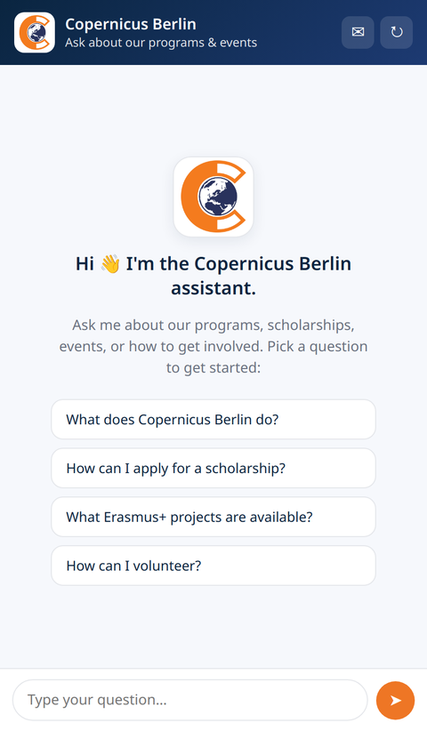
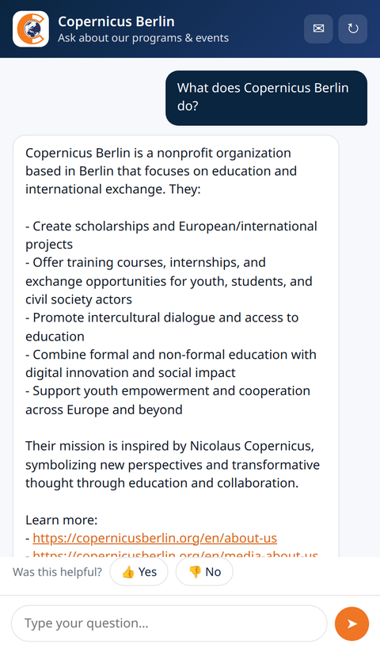
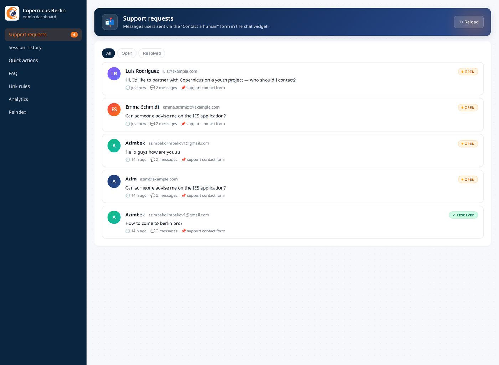
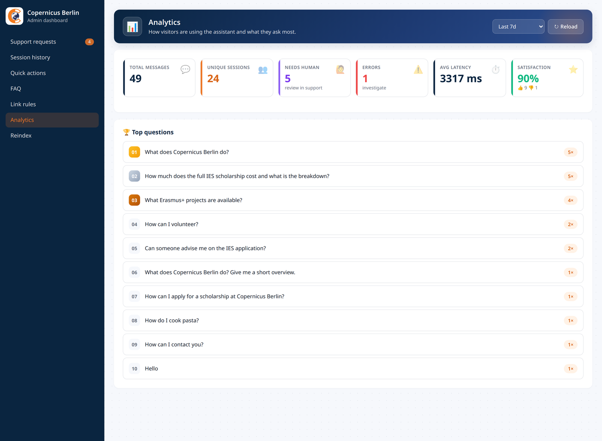
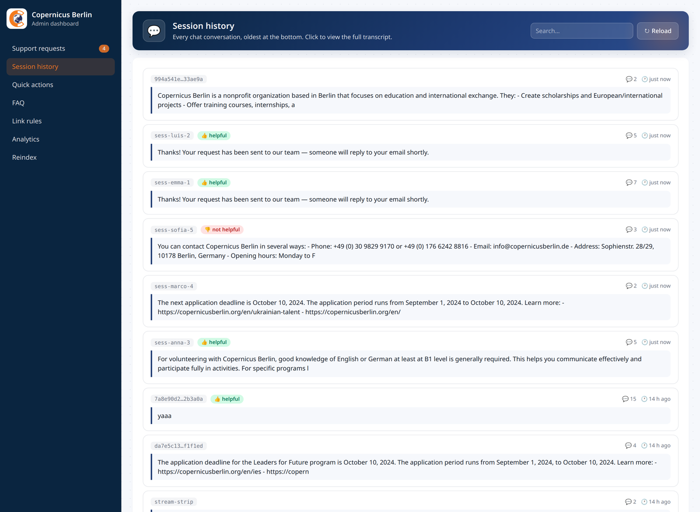
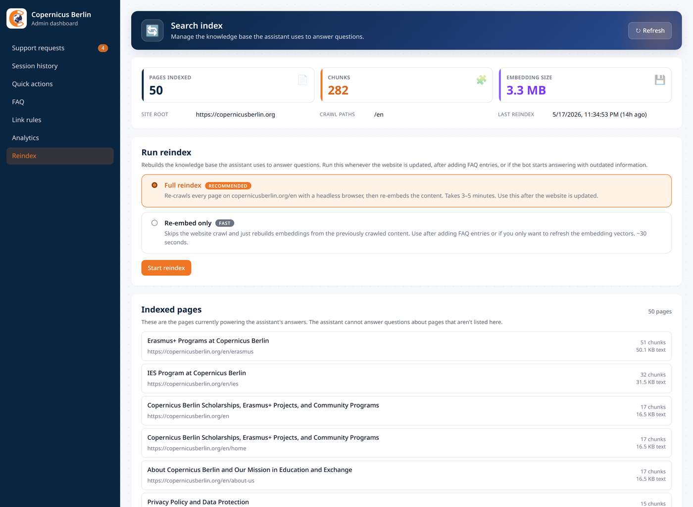

<div align="center">
  

  <h1>Copernicus Berlin — AI Assistant</h1>

  <p>
    <b>An embeddable chat assistant for <a href="https://copernicusberlin.org">copernicusberlin.org</a></b><br>
    Answers visitor questions about programs, scholarships, events, and how to get involved —
    with a built-in admin dashboard for monitoring conversations and managing the knowledge base.
  </p>

  <p>
    
    
    
    
    
  </p>

  <p>
    <a href="#-quick-start">Quick start</a> ·
    <a href="#-screenshots">Screenshots</a> ·
    <a href="#%EF%B8%8F-admin-dashboard">Admin dashboard</a> ·
    <a href="#-embed-on-your-website">Embed</a> ·
    <a href="#%EF%B8%8F-configuration">Configuration</a>
  </p>
</div>

---

## ✨ What it does

🤖 &nbsp; **Chat widget** — drops into any page as an iframe. Welcomes visitors,
suggests common questions, streams answers token-by-token, and offers a
"Contact a human" form that routes directly to the admin inbox.

📚 &nbsp; **Knowledge base** — automatically crawls every English page on
copernicusberlin.org and builds a searchable index. One-click rebuild
from the dashboard whenever the website changes.

🎛️ &nbsp; **Admin dashboard** — review every conversation, respond to support
requests, edit suggested questions, add manual FAQ entries, override
outbound links, and track usage analytics — all from one polished UI.

---

## 📸 Screenshots

<table>
  <tr>
    <td width="33%" align="center">
      
      <br><sub><b>Chat widget — welcome screen</b></sub>
    </td>
    <td width="33%" align="center">
      
      <br><sub><b>Streamed conversation with sources</b></sub>
    </td>
    <td width="33%" align="center">
      
      <br><sub><b>Admin — support requests inbox</b></sub>
    </td>
  </tr>
  <tr>
    <td align="center">
      
      <br><sub><b>Admin — usage analytics</b></sub>
    </td>
    <td align="center">
      
      <br><sub><b>Admin — session history</b></sub>
    </td>
    <td align="center">
      
      <br><sub><b>Admin — search index management</b></sub>
    </td>
  </tr>
</table>

---

## 🛠️ Tech stack

| Layer | Choice | Why |
|---|---|---|
| **Backend** | FastAPI · Python 3.11+ | Async, typed, well-documented |
| **Crawler** | Playwright (headless Chromium) | The Copernicus website is a client-rendered React SPA, so a normal HTTP crawler sees nothing |
| **Retrieval** | OpenAI `text-embedding-3-large` + BM25 lexical search | Hybrid scoring with URL-slug-aware boosting keeps program-specific facts (e.g. IES vs PIR scholarships) from getting mixed up |
| **Chat model** | OpenAI `gpt-4o-mini`, streaming | Fast first-token, strict context grounding |
| **Storage** | JSON files under `data/` | No database required — easy to back up, restore, and inspect |
| **Frontend** | Vanilla HTML / CSS / JS | No build step, no framework, instant edits |

---

## 🚀 Quick start

> **Requirements:** Python 3.11+, an OpenAI API key, ~500 MB free disk for the Chromium browser.

```bash
# 1️⃣  clone & enter
git clone https://github.com/Azimml/copernicus-ai.git
cd copernicus-ai

# 2️⃣  install Python deps + Chromium browser
make install

# 3️⃣  add your OpenAI API key
cp .env.example .env
#   ↳ open .env in your editor and fill in OPENAI_API_KEY

# 4️⃣  crawl the website and build the search index (3–5 min)
make index

# 5️⃣  start the server
make run
```

Then open in your browser:

| URL | What it is |
|---|---|
| 💬 &nbsp; http://localhost:8000/widget | **Chat widget** — embeddable assistant |
| 🎛️ &nbsp; http://localhost:8000/admin | **Admin dashboard** — open access on localhost |
| 📘 &nbsp; http://localhost:8000/docs | **Swagger API docs** — interactive |

---

## 🌐 Embed on your website

Drop this `<iframe>` wherever you want the chat to appear:

```html
<iframe
  src="https://your-deployment.example.com/widget"
  title="Copernicus Berlin Assistant"
  width="400"
  height="680"
  style="border:0; border-radius:12px; box-shadow:0 6px 30px rgba(0,0,0,.12)"
  loading="lazy"
></iframe>
```

Replace `your-deployment.example.com` with the host where this service is running.

---

## 🎛️ Admin dashboard

Seven sections, all open at `/admin`:

| Section | Purpose |
|---|---|
| 📬 &nbsp; **Support requests** | Every "Contact a human" submission. Reply directly; the assistant pauses while a human is on the conversation. |
| 💬 &nbsp; **Session history** | Every chat session with full transcript, satisfaction ratings, and relative timestamps. |
| ⚡ &nbsp; **Quick actions** | The suggested-question buttons shown to new visitors. Edit, reorder, enable/disable — changes go live immediately. |
| ❓ &nbsp; **FAQ** | Manual Q&A entries for topics not yet on the website. Automatically merged into the search index. |
| 🔗 &nbsp; **Link rules** | Override or hide the "Learn more" link the assistant attaches to specific question patterns. |
| 📊 &nbsp; **Analytics** | Total messages, unique sessions, satisfaction rate, average latency, and top questions — filterable by time range. |
| 🔄 &nbsp; **Search index** | Rebuild the knowledge base. <b>Full reindex</b> re-crawls every page (3–5 min); <b>Re-embed only</b> skips the crawl (~30 sec). |

---

## 🔄 Re-crawling the website

Whenever the Copernicus Berlin website is updated, refresh the assistant's
knowledge base:

1. Open the admin dashboard → **Search index**
2. Pick a mode:
   - **Full reindex** *(recommended)* — re-crawls every page on `copernicusberlin.org/en`. Takes 3–5 minutes.
   - **Re-embed only** — skips the crawl, just rebuilds embeddings from existing content. ~30 seconds.
3. Click **Start reindex** and wait. You can navigate away — the job runs to completion.

For automated workflows you can also run `make index` from the shell.

---

## ⚙️ Configuration

All settings live in `.env`. The essentials:

| Variable | Default | Purpose |
|---|---|---|
| `OPENAI_API_KEY` | — | **Required.** Used for both chat and embeddings. |
| `OPENAI_CHAT_MODEL` | `gpt-4o-mini` | Chat completion model. |
| `OPENAI_EMBEDDING_MODEL` | `text-embedding-3-large` | Embedding model for retrieval. |
| `SITE_ROOT` | `https://copernicusberlin.org` | Root URL to crawl. |
| `CRAWL_PATHS` | `/en` | Comma-separated path prefixes to crawl. |
| `CRAWL_EXCLUDE_HOSTS` | `campus.copernicusberlin.org` | Hosts to skip during crawling. |
| `CRAWL_MAX_PAGES` | `200` | Safety cap on pages crawled per run. |
| `RETRIEVAL_TOP_K` | `8` | Number of chunks pulled into the prompt per query. |
| `APP_PORT` | `8000` | HTTP port the server listens on. |

See [.env.example](.env.example) for the full list.

---

## ✉️ Email replies to support requests

When a visitor submits the **Contact a human** form, the admin sees the
request in the dashboard. When the admin replies, the message is sent as an
email to the address the visitor provided — **not** back into the chat
widget.

Configure SMTP in `.env`. Examples:

**🚀 Resend** *(recommended for demos — free, no credit card, 5-minute setup)*

[Resend](https://resend.com) gives you 100 emails/day and 3,000/month for
free. You can start sending immediately to your registered account email
without verifying a domain — perfect for a demo. For production, add one
DNS record at [resend.com/domains](https://resend.com/domains) to send from
your own domain.

```env
SMTP_HOST=smtp.resend.com
SMTP_PORT=587
SMTP_USER=resend
SMTP_PASSWORD=re_xxxxxxxxxxxxxxxxxxxx
SMTP_USE_TLS=true
SMTP_FROM=onboarding@resend.dev   # testing; swap for chat@yourdomain after verifying
SMTP_FROM_NAME=Copernicus Berlin
```

**Gmail** *(use an [App Password](https://myaccount.google.com/apppasswords),
not your account password):*
```env
SMTP_HOST=smtp.gmail.com
SMTP_PORT=587
SMTP_USER=replies@yourdomain.com
SMTP_PASSWORD=xxxx-xxxx-xxxx-xxxx
SMTP_USE_TLS=true
SMTP_FROM=replies@yourdomain.com
SMTP_FROM_NAME=Copernicus Berlin
```

**Mailgun** *(or any other standard SMTP provider — Postmark, SendGrid,
AWS SES, Sendinblue, etc.):*
```env
SMTP_HOST=smtp.mailgun.org
SMTP_PORT=587
SMTP_USER=postmaster@mg.yourdomain.com
SMTP_PASSWORD=your-mailgun-smtp-password
SMTP_USE_TLS=true
SMTP_FROM=replies@yourdomain.com
SMTP_FROM_NAME=Copernicus Berlin
SMTP_REPLY_TO=team@copernicusberlin.org
```

If `SMTP_HOST` is empty, the reply is still recorded in the handoff log but
no email leaves the server. The admin modal shows a clear warning:
**⚠ Reply saved but email NOT sent — SMTP is not configured**.

Successful sends show **✓ Email sent to user@example.com**; failures show
the SMTP error so you can debug.

---

## 📁 Project structure

```
copernicus-ai/
├── 📂 app/
│   ├── 📂 api/routes.py        ← FastAPI endpoints (chat, admin)
│   ├── 📂 core/                ← config, JSON helpers
│   ├── 📂 models/schemas.py    ← Pydantic request/response models
│   ├── 📂 services/            ← chat, retrieval, indexer, crawler, handoff, …
│   ├── 📂 static/widget/       ← chat widget (HTML / CSS / JS + logo)
│   ├── 📂 static/admin/        ← admin dashboard
│   └── 📄 main.py              ← FastAPI app entrypoint
├── 📂 data/
│   ├── 📂 raw/                 ← crawled content, FAQ, link rules, sessions
│   └── 📂 index/               ← embeddings (.npy) + chunk metadata (.json)
├── 📂 doc/screenshots/         ← README screenshots
├── 📂 scripts/build_index.py   ← CLI to rebuild the index
├── 📄 Makefile                 ← install / index / run shortcuts
├── 📄 requirements.txt
└── 📄 .env.example
```

---

## 🚆 Deploy to Railway in 5 minutes

The repo ships with a `Dockerfile` + `railway.toml` so deployment is a
**one-click** affair.

1. Go to **[railway.com](https://railway.com)** → sign in with GitHub.
2. **New Project** → **Deploy from GitHub repo** → pick `Azimml/copernicus-ai`.
3. Railway detects the Dockerfile and starts building (~3-5 min on first build).
4. While it's building, go to **Variables** and paste your `.env` values
   (at minimum `OPENAI_API_KEY`, `SMTP_HOST`, `SMTP_USER`, `SMTP_PASSWORD`,
   `SMTP_FROM`, `ADMIN_TOKEN`).
5. Once the build is green, click **Settings → Networking → Generate Domain**
   to get a `yourapp.up.railway.app` URL.
6. (Optional) **Settings → Custom Domain** → add your own domain. Railway
   gives you a CNAME target; add it to your DNS provider. HTTPS is automatic.

The repo's defaults are tuned for Railway's free $5 trial credit:

- `WORKERS=2` keeps RAM around ~500 MB (~$0.20/day on Railway)
- `healthcheckPath=/api/health` for zero-downtime redeploys
- SQLite + crawled index ship in the image, so the first request works
  immediately without running `make index`

For long-term production, mount a **volume at `/app/data`** so chat logs,
support requests, and analytics persist across container restarts.

---

## 🚢 Deployment notes

- The service runs as **multiple uvicorn workers** in a single process tree
  (default: 4). Override with `make run WORKERS=8` on larger hardware.
- Persistent data lives in **`data/`** (SQLite database + crawled docs +
  embeddings). Mount it as a volume in production so conversation history,
  support requests, and configuration survive container restarts.
- Playwright needs system libraries for Chromium. On Debian/Ubuntu `make install`
  pulls these automatically; on Alpine install them manually
  (`apk add chromium nss freetype …`).
- For HTTPS, terminate TLS at the reverse proxy. The widget iframe must be
  embedded over the **same scheme** as the host page or browsers will block it.
- Set `OPENAI_API_KEY` and any non-default settings as **environment variables**
  in production rather than committing them to `.env`.

---

## 📈 Scaling & capacity

How much traffic can this handle? With the defaults below, **~500 concurrent
chats** comfortably on a modest VPS — well above what a typical org website
needs.

### What's built in

| Optimisation | Why it matters |
|---|---|
| **Multi-worker uvicorn** *(default 4)* | Parallel request handling across all CPU cores. |
| **SQLite + WAL mode** | Concurrent-safe writes, sub-ms reads, no separate DB server. All workers share state via one file. |
| **Cross-worker session memory** | A follow-up message lands on any worker and still finds the prior conversation. |
| **Embedding LRU cache** *(2,048 entries / worker)* | Skips OpenAI for repeat queries. Typical hit rate after warmup: 30-50%. |
| **First-turn answer cache** *(10 min TTL)* | Popular questions skip the LLM entirely. For org chatbots where top-N questions are 60%+ of traffic, this is a big OpenAI bill saving. |
| **Background reindex** | The 3-5 minute crawl runs in a daemon thread — the HTTP workers stay responsive. Admin UI polls `/admin/reindex-status` for progress. |

### Capacity estimates

On a **Hetzner CPX21** (3 vCPU, 4 GB RAM, €5/mo) with the defaults:

| Concurrent chats | Behavior |
|---|---|
| ≤ 50 | Smooth — sub-3-second responses |
| 50–200 | Some queueing — responses arrive in 5-10 sec |
| 200–500 | OpenAI rate limits become the bottleneck, not the server |
| 500+ | Need to scale OpenAI tier or shard across machines |

> **1,000 visitors/day translates to ~5-30 concurrent at peak.** This setup
> handles that with significant headroom.

### Recommended production setup

```
┌──────────────┐    HTTPS     ┌──────────────────┐
│  Cloudflare  │ ───────────▶ │  Origin (VPS)    │
│  (free tier) │              │  ┌────────────┐  │
└──────────────┘              │  │  Caddy     │  │  ← TLS + static caching
       │                      │  └─────┬──────┘  │
       │ DDoS / WAF / CDN     │        │         │
       │ static asset cache   │  ┌─────▼──────┐  │
       │                      │  │  uvicorn   │  │  ← 4 workers
       │                      │  │  workers   │  │
       │                      │  └─────┬──────┘  │
                              │        │         │
                              │  ┌─────▼──────┐  │
                              │  │ SQLite DB  │  │  ← WAL mode
                              │  └────────────┘  │
                              └──────────────────┘
```

**Step-by-step:**

1. **Spin up a small VPS** — Hetzner CPX21 (€5/mo) or DigitalOcean $12 droplet.
2. **Install Docker** or just run `make install` natively.
3. **Reverse proxy** — Caddy with auto-HTTPS is the simplest:
   ```caddyfile
   chat.copernicusberlin.org {
       reverse_proxy 127.0.0.1:8000
   }
   ```
4. **Cloudflare in front** (free tier is enough):
   - Add the domain to Cloudflare, set the DNS record to "proxied" (orange cloud).
   - Cloudflare absorbs DDoS, caches the static widget/admin assets at the edge,
     and gives you free TLS in front of Caddy.
5. **Persistent data** — back up `data/copernicus.db` daily.
   ```bash
   sqlite3 data/copernicus.db ".backup '/backups/copernicus-$(date +%F).db'"
   ```
6. **Monitoring** — `GET /api/health` returns runtime stats and cache hit rates.

### When to upgrade

If `chat_errors` in `/api/health` keeps growing or OpenAI bills jump
unexpectedly, check `/api/health` → `caches`:

- **Low embedding hit rate** → users are asking very diverse questions; this is
  normal, no fix needed.
- **Low answer hit rate** *but* the same top-N questions appear in Analytics →
  raise `_AnswerCache` TTL or `max_entries` in [`app/services/chat.py`](app/services/chat.py).
- **HTTP errors during traffic spikes** → bump `WORKERS` from 4 to 8 first; if
  CPU is pegged, move to a bigger VPS.

---

<div align="center">
  <sub>Built for <a href="https://copernicusberlin.org">Copernicus Berlin e. V.</a></sub>
</div>
